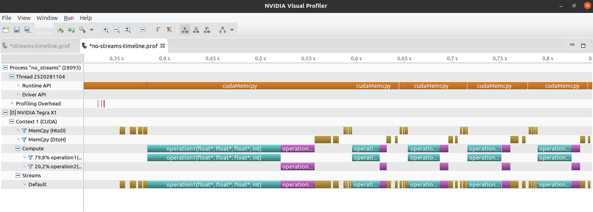
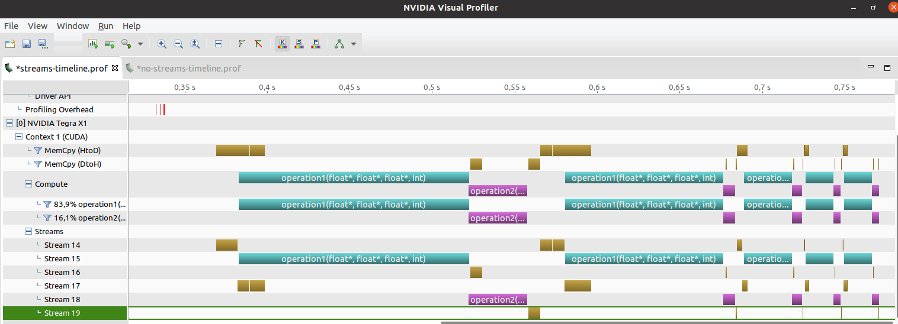

# CUDA Device overlap optimization
## Introduction
This project aims to demonstrate how we can benefit with the overlap of transfers while computations are being performed in the GPU

## Defining the dependencies
Approach:
We want to compute two kernels which have two inputs and one
output each. I will show the benefits of using asynchronous
copies.

The architecture has three streams:
* Host To Device copies
* Kernel computation
* Device To Host copies

Definitions:
* operation1(d1_a, d1_b, d1_c)
* operation2(d2_a, d2_b, d2_c)
* 6 streams
* 4 events

Dependencies:
  * stream1 -> d1_a, d1_b
  * stream2 -> operation1 | event1 -> wait for stream1
  * stream3 -> d1_c | event2 -> wait for stream2
  * stream4 -> d2_a, d2_b
  * stream5 -> operation2 | event3 -> wait for stream4
  * stream6 -> d2_c | event4 -> wait for stream5 
Flow (2 iterations):
  H2D          1_a, 1_b  2_a, 2_b 
  Computation            operation1 operation2
  D2H                               1_c        2_c

We will be using "pinned memory" to ensure the memory it is not swapped out through the API call `cudaMallocHost`. After that we will be creating the different streams, each one will allow us to have events related each other, i.e. they will trigger other operations. Specifically we will call to `cudaMemcpyAsync` to perform asynchronous copies while the kernel is executed, and then `cudaStreamWaitEvent` to ensure previous operation has finished properly, either transfers or computations.


# Build
## Requirements
CUDA toolkit should be available in the system. The `makefile` uses `nvcc` to compile the code

## Instructions
```
make
nvprof --export-profile streams-timeline.prof ./streams
nvprof --export-profile no-streams-timeline.prof ./no_streams
nvvp no-streams-timeline.prof streams-timeline.prof
```

# Results

The following shows the naive version. Where the default stream is used, so all the overations are done sequentially


The next represent the execution of the streams version where up to 6 streams have been used. As can be seen operations in streams 15 and 18 respectively are overlapped with the transfers present in the other streams. Of course, this version runs faster that the previous one.
After having a deeper look we can benefit by sending bigger data blocks, which is another technique, that will not be done here, but it would help us to hide the wide computation time compared with the transfer time. 
